## 1. Introdução

O presente guia tem por objetivo orientar usuário do sistema WebPMO na declaração dos dados de sua responsabilidade para o horizonte de curto prazo, com vistas à elaboração do Programa Mensal de Operação Energética - PMO do Operador Nacional do Sistema Elétrico - ONS. O sistema, em operação desde 2014, viabiliza e operacionaliza o fluxo de coleta e consistência de dados para o PMO e suas revisões semanais, garantindo a eficiência e segurança do processo.

Neste guia, serão abordados os aspectos regulatórios que regem o processo do PMO e suas principais características, as formas de acesso ao sistema e solicitação de cadastro de novos usuários, bem como o detalhamento dos insumos que podem ser enviados pelos Agentes de Geração[^1], finalizando com um resumo dos principais links úteis relacionados ao processo do PMO e contatos da Gerência de Programação Mensal - PRM.

## 2. Programa Mensal de Operação Energética - PMO

### 2.1. Regulação

A Resolução Normativa ANEEL Nº 1.032/2022 [1], a qual consolida os atos regulatórios relativos à elaboração do PMO, define o seu objetivo por *"estabelecer as metas e diretrizes eletroenergéticas da operação do Sistema Interligado Nacional – SIN, de forma a assegurar a otimização dos recursos disponíveis para atendimento da carga".*

Para tal, é de responsabilidade da equipe do PMO do ONS a coordenação e a elaboração do Programa Mensal, de forma a atender o processo descrito pelos Submódulos 4.3 – Procedimental [2] e 4.3 – Responsabilidades [3] dos Procedimentos de Rede do ONS. Aos Agentes de Geração, cabe o fornecimento *"ao ONS, nos formatos, meios e prazos estabelecidos, os dados de usinas simuladas individualmente nos modelos energéticos necessários para a realização do PMO e suas revisões"*. A análise e consolidação de tais dados e informações recebidos é de responsabilidade do Operador.

Dessa forma, os capítulos a seguir do Guia tem como finalidade auxiliar os Agentes no envio dos insumos que farão parte dos dados de entrada no modelo DECOMP.

### 2.2. Modelo DECOMP

Desenvolvido pelo Centro de Pesquisas de Energia Elétrica – CEPEL, o modelo DECOMP é a ferramenta oficial de elaboração do PMO pelo ONS e para estabelecimento do Preço de Liquidação de Diferenças - PLD, pela Câmara de Comercialização de Energia Elétrica – CCEE. O modelo trata do problema de planejamento de curto de prazo de sistemas hidrotérmicos e seu objetivo principal é indicar, para cada estágio (semanal ou mensal) e patamar de carga considerados no estudo, os montantes de geração de usinas hidrelétricas e termelétricas, com base nas previsões de afluência e carga e a disponibilidade dos componentes do sistema. Além das metas de geração, define os valores dos intercâmbios de energia entre subsistemas e o Custo Marginal de Operação – CMO, de modo a minimizar o valor esperado do custo total de operação ao longo do horizonte do estudo levando-se em conta os critérios de aversão a risco estabelecidos.

O DECOMP integra uma cadeia de modelos de otimização energética, sendo precedido pelo modelo NEWAVE, de médio prazo, e sucedido pelo modelo DESSEM, de curtíssimo prazo. Os três modelos são executados de forma encadeada, acoplados entre eles pela Função de Custo Futuro – FCF gerada pelo modelo antecessor, no caso do DECOMP e DESSEM. A Tabela 1 resume as principais características dos modelos:

| Prazo | Aplicação | Horizonte | Discretização | Árvore de Cenários | Modelagem do Sistema | Estratégia de Solução |
|---|---|---|---|---|---|---|
| Médio | Mensal | 10 anos | Mensal, patamares de carga | Estocástica, amostra de cenários | Usinas individualizadas, Reservatórios equivalentes e intercâmbios | PDDE |
| Curto | Semanal | 2 meses (pode ir até 1 ano) | Sem/Mensal, patamares de carga | Determinística + Estocástica, árvore completa | Usinas individualizadas e intercâmbios | PDD |
| Curtíssimo | Diário | 2 semanas | meia-hora | Determinística | *Unit commitment* térmico, fluxo DC | MILP |

<p class="tbl-cap">Tabela 1 - Encadeamento dos modelos via horizonte rolante. Fonte: CEPEL [5].</p>

Todos os Manuais de Referência[^2] e Manuais do Usuário[^3] da cadeia de modelos de otimização se encontram disponíveis na área de documentação técnica [4] e no ambiente Libs [5] disponibilizados pelo CEPEL.

Para a execução da versão vigente do modelo DECOMP na cadeia oficial de modelos de programação da operação e formação de preço, são necessários alguns arquivos de entrada:

| Nome do arquivo | Descrição |
|---|---|
| `CASO.dat` | Contém nome do arquivo que lista os arquivos de entrada do estudo |
| `CORTES-0MM.dat` | FCF produzida pelo NEWAVE |
| `CORTESH.dat` | Cabeçalho da FCF produzida pelo NEWAVE |
| `DADGER.rvX` | Arquivo com os dados gerais do estudo |
| `DADGNL.rvX` | Arquivo com os dados de entrada das usinas termelétricas a GNL |
| `HIDR.dat` | Cadastro de dados das usinas hidrelétricas |
| `INDICES.csv` | Arquivo que indica o polinjus |
| `MLT.dat` | Arquivo que contém o histórico mensal de vazão, em valores de média de longo termo (estes valores são utilizados nos relatórios da operação do modelo DECOMP) |
| `PERDAS.dat` | Arquivo de fatores de perda |
| `POLINJUS.csv` | Arquivo de cadastro das famílias de curvas de polinômios de jusante |
| `RENOVAVEIS.csv` | Arquivo contendo a previsão de geração em blocos de energia para as usinas não simuladas individualmente |
| `rvX` | Arquivo descritor dos dados de entrada do estudo |
| `VAZOES.rvX` | Arquivo com os dados do(s) cenário(s) de vazões |

<p class="tbl-cap">Tabela 2 - Lista dos principais arquivos de entrada do modelo DECOMP</p>

Onde "X" é a extensão utilizada nos estudos do DECOMP seguindo o critério de numeração das revisões do PMO. A extensão RV0 está associada ao estudo de elaboração do PMO, e à medida que ocorrem revisões da programação, a extensão assume valores sequenciais: RV1 (primeira revisão), RV2 (segunda revisão) e assim por diante. E "MM" é o referido mês do PMO.

### 2.3. Estrutura dos Estudos

Atualmente, o horizonte de estudo do modelo DECOMP, utilizado para a confecção do PMO, é de dois meses, sendo o primeiro determinístico, discretizado semana a semana, e o segundo mês sendo estocástico, englobando o mês em um só bloco.

As semanas operativas correspondem ao período que se inicia à **0h00min do sábado e termina às 24h00min da sexta-feira** subsequente e abrangem todos os dias do mês a que se refere o estudo, podendo também incluir dias dos meses adjacentes.

A descrição acima pode será exemplificada a seguir:

<p class="u"><u>PMO de Novembro de 2024</u></p>

O PMO de Novembro possui 7 estágios, sendo estes formados por 6 semanas operativas e pelo segundo mês de estudo (dezembro), como explicitado na figura a seguir.

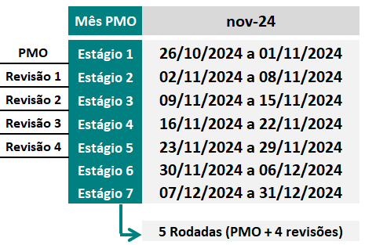

Pelo exemplo dado, nota-se que a primeira semana operativa do PMO de Novembro inclui dias do mês de outubro. Isso decorre do fato de que o conjunto de semanas operativas que forma o primeiro mês de estudo precisa contemplar todos os dias do referido mês. Tendo em vista que as semanas operativas vão sempre de sábado a sexta-feira, se faz necessário incluir dias de mês anterior às semanas operativas que compõe o primeiro mês de estudo.

É também importante notar que o primeiro dia do último estágio (segundo mês) é dado pelo primeiro dia após a última semana operativa, **não sendo necessariamente o primeiro dia do mês civil**. No caso exemplificado acima o último estágio começa no sétimo dia do mês, pois a última semana operativa termina às 24h da sexta-feira, dia 06/12/2024.

<p class="u"><u>PMO de Dezembro de 2024</u></p>

O PMO de Dezembro possui 6 estágios, sendo estes formados por 5 semanas operativas e pelo segundo mês de estudo, como explicitado na figura a seguir.

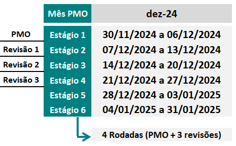

No caso acima, o último estágio (segundo mês de estudo) começa no dia 04/01/2025, pois a última semana operativa, que garante que todos os dias do primeiro mês de estudo estejam contemplados, termina às 24:00h da sexta-feira, dia 03/01/2025. O último estágio termina sempre no último dia do segundo mês civil.

Dependendo do mês do estudo, o número de semanas operativas e, consequentemente, o número de estágios e revisões, podem variar. No primeiro exemplo, o PMO tem 6 semanas operativas e conta com 4 revisões (além da revisão 0). Já no segundo exemplo, o PMO tem 5 semanas operativas e conta com 3 revisões (além da revisão 0).

Além disso, é válido ressaltar que, por consequência das definições apresentadas, **a última semana operativa de um dado PMO se torna a primeira semana operativa do PMO seguinte, caso esta semana possua dias do mês posterior.** Nos exemplos apresentados, a semana de 30/11/2024 a 06/12/2024 é o último estágio semanal do PMO de Novembro de 2024 e primeiro estágio semanal do PMO de Dezembro de 2024. Nos demais casos, em que o encerramento do primeiro mês do PMO seja coincidente com o final do mês civil, o próximo PMO será iniciado no primeiro dia do mês.

<div class="callout callout-qr">

<div><p>A equipe do PMO disponibiliza na página da Programação Mensal no SINtegre um painel com as informações gerais do PMO e suas revisões, com suas respectivas datas ao longo do ano. O painel se encontra disponível em <a href="https://sintegre.ons.org.br/sites/9/52/paginas/default.aspx" target="_blank" rel="noopener">sintegre.ons.org.br/sites/9/52</a> e também pode ser acessado utilizando o QR Code ao lado.</p></div>
</div>

### 2.4. Prazos do PMO e suas revisões

Em semanas de PMO, estes são os principais prazos para elaboração do estudo que devem ser cumpridos pelo ONS e pelos Agentes de Geração para o modelo de curto prazo:

- Na segunda-feira às 08:00, o sistema WebPMO é aberto para recebimento dos insumos até às 17:00 do mesmo dia;
- Até às 12:00 de quinta-feira, podem ser enviadas retificações dos dados informados;
- Na quarta-feira às 09:00, o ONS rejeita o insumo de "volume inicial" para reenvio dos dados mais atualizados, a fim de maior acurácia dos níveis de partida do estudo, com prazo de envio até às 16:00 do mesmo dia;
- Na quinta-feira às 14:00, se inicia o 1º dia da Reunião do PMO[^4], na qual são apresentados os dados de entrada nos modelos energéticos de médio e curto prazo, bem como as condições eletroenergéticas do SIN;
- Na sexta-feira às 09:30, se inicia o 2º dia da Reunião do PMO, onde são apresentados os principais resultados do PMO, com a previsão de vazões e resultados do modelo de curto prazo;
- Até às 10:00 de sexta-feira, são disponibilizados no SINtegre o [deck preliminar](https://sintegre.ons.org.br/sites/9/52/paginas/servicos/historico-de-produtos.aspx?produto=Deck%20Preliminar%20DECOMP%20-%20Valor%20Esperado) para avaliação[^5] dos Agentes e os [dados dos Agentes de Geração](https://sintegre.ons.org.br/sites/9/52/paginas/servicos/historico-de-produtos.aspx?produto=Dados%20Semanais%20dos%20Agentes%20de%20Gera%C3%A7%C3%A3o%20para%20o%20PMO) utilizados no estudo;
- Até às 12:00 da sexta-feira, é publicado o [deck oficial do modelo de curto prazo](https://sintegre.ons.org.br/sites/9/52/paginas/servicos/historico-de-produtos.aspx?produto=Deck%20e%20Resultados%20DECOMP%20-%20Valor%20Esperado);
- Durante a sexta-feira, são publicados os relatórios com os principais resultados do PMO[^6].

Na Figura 3 abaixo, é mostrada uma linha do tempo com os principais prazos do PMO mencionados:

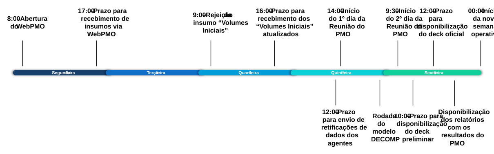

Nas semanas de revisões do PMO, os principais prazos a serem cumpridos se diferem em relação aos do PMO para o horizonte de curto prazo:

- Na quarta-feira às 08:00, o sistema WebPMO é aberto para recebimento dos insumos até às 11:00 da quinta-feira;
- Até às 14:00 de quinta-feira, podem ser enviadas retificações dos dados informados;
- Até às 10:00 de sexta-feira, são disponibilizados no SINtegre o [deck preliminar](https://sintegre.ons.org.br/sites/9/52/paginas/servicos/historico-de-produtos.aspx?produto=Deck%20Preliminar%20DECOMP%20-%20Valor%20Esperado) para avaliação[^7] dos Agentes e os [dados dos Agentes de Geração](https://sintegre.ons.org.br/sites/9/52/paginas/servicos/historico-de-produtos.aspx?produto=Dados%20Semanais%20dos%20Agentes%20de%20Gera%C3%A7%C3%A3o%20para%20o%20PMO) utilizados no estudo;
- Até às 12:00 da sexta-feira, é publicado o [deck oficial do modelo de curto prazo](https://sintegre.ons.org.br/sites/9/52/paginas/servicos/historico-de-produtos.aspx?produto=Deck%20e%20Resultados%20DECOMP%20-%20Valor%20Esperado);
- Na sexta-feira às 15:00, se inicia a Reunião Semanal da Programação da Operação[^8], na qual são apresentadas as condições hidrológicas e eletroenergéticas do SIN e as principais informações relevantes da a revisão do PMO;
- Durante a sexta-feira, são publicados os relatórios com os principais resultados da revisão do PMO[^9].

Na Figura 4 abaixo, é mostrada uma linha do tempo com os principais prazos mencionados para as revisões do PMO:

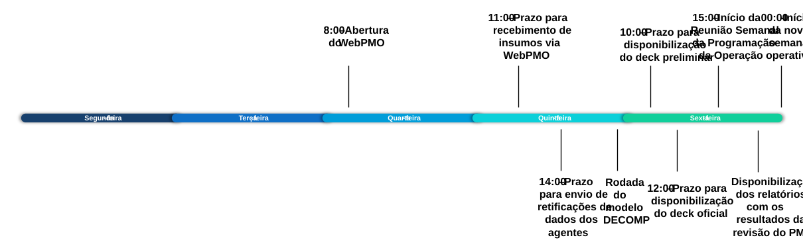

Todos os produtos informados (relatórios, decks preliminares e oficiais e dados dos agentes de geração para o PMO) ficam disponíveis na [aba de produtos](https://sintegre.ons.org.br/sites/9/52/paginas/servicos/produtos.aspx) na [área da Programação Mensal da Operação Energética no SINtegre](https://sintegre.ons.org.br/sites/9/52). Também nessa mesma área, está disponível um painel com as informações gerais do PMO, contendo os principais prazos das atividades do PMO e suas revisões.

Caso haja necessidade de alteração nos dias da semana e horários indicados acima, como na ocorrência de feriados, cabe ao ONS informar de forma antecipada via SINtegre ou em reuniões abertas com os Agentes os novos prazos a serem atendidos em cada excepcionalidade. As novas datas também podem ser vistas acessando o painel citado no tópico anterior (Estrutura dos Estudos).

## 3. WebPMO

### 3.1. Acesso ao sistema

O envio semanal de dados para o PMO do ONS se dá pelo sistema [WebPMO](https://pops.ons.org.br/pop/#6325), acessível através do [SINtegre](https://sintegre.ons.org.br/).

<div class="callout callout-qr">

<div><p>A equipe do PMO disponibiliza um <a href="https://www.youtube.com/watch?v=PAFxhsdwYtI&amp;ab_channel=ONS" target="_blank" rel="noopener">vídeo tutorial</a>, também disponível pelo QRcode ao lado, com o passo a passo de como acessar o WebPMO. Alternativamente, seguem abaixo as instruções de acesso ao sistema:</p></div>
</div>

<ol class="steps">
<li> No SINtegre, clicar no ícone no canto superior esquerdo da tela e procurar por WebPMO.</li>
</ol>

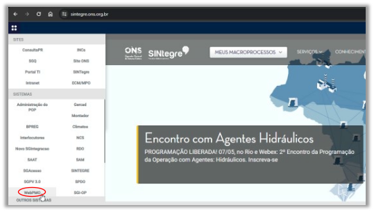

<ol class="steps" start="2">
<li>Para acesso à funcionalidade de envio de dados, clicar em "Estudo" e, em seguida, em "Informar dados".</li>
</ol>

<figure class="fig">
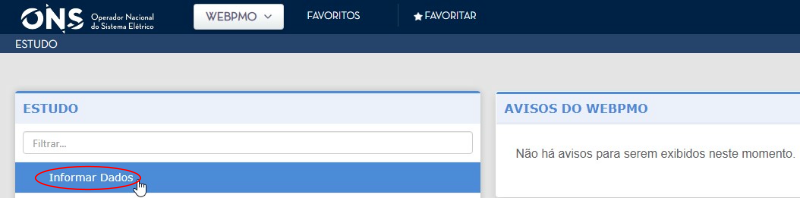
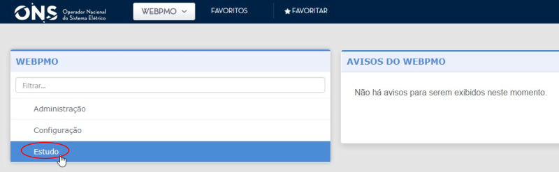
<figcaption><span class="fig-num">Figura 6: </span>Página do WebPMO para acessar o envio de dados para o PMO.</figcaption>
</figure>

<ol class="steps" start="3">
<li>Na tela "Informar Dados", selecionar o estudo, agente e o insumo que deseja enviar.</li>
</ol>

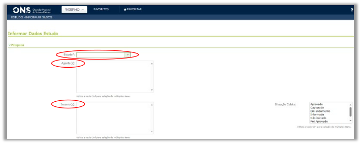

### 3.2. Solicitação de cadastro de novos usuários

O acesso ao WebPMO é concedido apenas para usuários que enviam informações a serem consideradas como dado de entrada para elaboração do PMO e suas revisões semanais, de acordo com as responsabilidades definidas no Submódulo 4.3 dos Procedimentos de Rede.

Após a realização do devido cadastro do usuário no SINtegre, este poderá solicitar à equipe do PMO o acesso ao WebPMO via SINtegre. Por questões de segurança e confidencialidade do processo, a solicitação de cadastro de novos usuários será aceita mediante envio de documentação comprobatória da necessidade de acesso ao sistema para o envio de dados. O envio da comprovação poderá ser feito dentro da própria solicitação de acesso ao sistema[^10] no SINtegre. Nesse sentido, indicamos o seguinte passo a passo:

1. O gestor direto do novo usuário que pretende acessar o WebPMO ou um funcionário da empresa do novo usuário que já acesse o WebPMO envia um e-mail para a equipe do PMO (<pmo@ons.org.br>) solicitando o acesso do novo usuário ao WebPMO. O corpo do e-mail deve conter as seguintes informações: nome e e-mail do usuário cadastrado no SINtegre e em nome de qual Agente o solicitante fará o envio de dados.
2. O novo usuário que pretende acessar o WebPMO faz a solicitação de acesso ao sistema diretamente no SINtegre e anexa à solicitação um print da mensagem enviada à equipe do PMO pelo gestor ou funcionário da mesma empresa.
3. A equipe do PMO vai receber a solicitação e, caso a solicitação atenda aos requisitos expostos acima, proceder com o acesso do usuário ao sistema.

### 3.3. Coleta de dados

No PMO e nas suas revisões semanais, deverão ser incorporadas informações atualizadas referentes ao estado do sistema, às previsões de carga e afluências e aos demais dados que tenham a periodicidade de atualização inferior a um mês. Apenas para a elaboração do PMO há a atualização da FCF do modelo de médio prazo, NEWAVE, que, portanto, será feita mensalmente.

Sendo assim, os insumos a serem enviados pelos Agentes de Geração no WebPMO serão os de periodicidade de atualização semanal e que devem estar de acordo com as datas das semanas operativas do PMO em análise e seguindo os prazos determinados para envio dos dados, ambos descritos no capítulo 2 deste guia.

No capítulo 4, cada insumo será detalhado, indicando onde pode ser encontrado nos arquivos de entrada do modelo DECOMP, fundamentalmente nos arquivos *dadger* ou *dadgnl*, e como devem ser enviados, seguindo os parâmetros de entrada do modelo e os Procedimentos de Rede.

#### 3.3.1. Situação da Coleta

No momento de abertura do estudo no WebPMO, os Agentes receberão notificação por e-mail e os status dos insumos são ajustados para <span class="status status-nao">"Não iniciado"</span>. Este status permanece até o Agente realizar a sua 1ª alteração. Em seguida, os próximos passos se darão de acordo com o fluxograma abaixo, em que as etapas do processo se encontram sinalizadas em linha contínua e o fluxo de informações em linhas tracejadas. As ações e insumos de posse dos Agentes de Geração foram representados em azul e as ações e insumos de posse do ONS na cor verde.

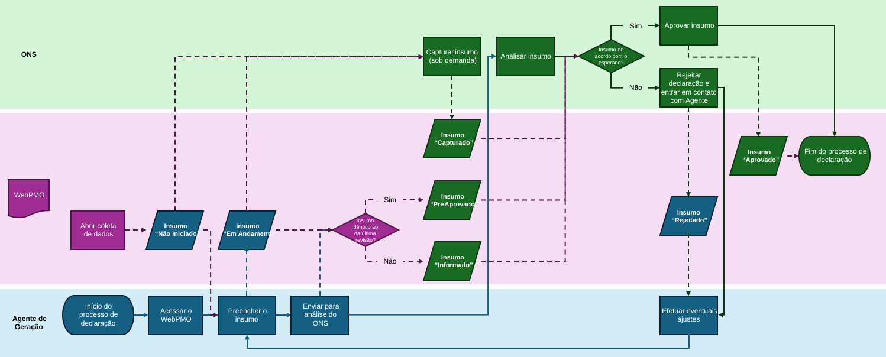

Quando o Agente realiza a 1ª alteração, preenchendo as informações, e clica no botão "Salvar", para salvar o insumo para posterior revisão, seu status passa para <span class="status status-and">"Em andamento"</span>. Nesta condição, a Equipe do PMO ainda não consegue aprová-lo. No entanto, caso o insumo não seja enviado ou o Agente responsável realize o preenchimento e esqueça de enviar o formulário, a Equipe do PMO poderá efetuar a ação de capturar, permitindo a continuação do processo e fazendo com que o insumo assuma o status de <span class="status status-cap">"Capturado"</span>.

Após preencher e salvar, o Agente deverá enviar o insumo para análise do ONS, clicando no botão "Enviar". Dessa forma, o status será dado como <span class="status status-inf">"Informado"</span>, sendo ainda possível que o Agente faça ajustes nas informações. Caso o insumo não tenha alteração em relação ao envio realizado na semana anterior e tenha sido enviado para análise, o status se caracterizará como <span class="status status-pre">"Pré-aprovado"</span> e, neste caso, o Agente não poderá mais fazer ajustes nas informações.

Por fim, feito o envio pelo Agente, o insumo será analisado pela Equipe do PMO do ONS, podendo assumir os status de: <span class="status status-rej">"Rejeitado"</span>, em que se entende que ajustes precisam ser feitos por parte do Agente, que deverá avaliar o motivo de rejeição (avaliar campo de mesmo nome no formulário, preenchido pelo ONS) e reenviar o mesmo dado ou efetuar os ajustes recomendados; ou <span class="status status-apr">"Aprovado"</span> quando não foi verificada a necessidade de ajustes e o Agente não tem mais acesso à alteração da informação. Os dados finais aprovados serão os utilizados na elaboração do arquivo *dadger* ou *dadgnl* para a realização dos estudos do PMO e revisões.

## 4. Insumos enviados por meio do WebPMO

### 4.1. Usinas hidrelétricas

#### 4.1.1. Volumes iniciais

O insumo relativo ao volume inicial dos reservatórios é coletado apenas para os reservatórios de regulação semanal ou mensal, conforme cadastro vigente das usinas hidrelétricas disponível no arquivo *hidr.dat*, uma vez que as hidrelétricas com reservatórios diários são consideradas como fio-d'água pelo modelo DECOMP.

O volume inicial dado como entrada para o modelo é a estimativa do valor armazenado no reservatório para o início da primeira semana operativa do estudo, ou seja, a previsão do nível que o reservatório deverá alcançar **ao final do dia na sexta-feira (23:59) e início de sábado (00:00)**. O valor deve ser informado em **percentual do volume útil** (%VU), volume do reservatório compreendido entre o nível máximo operativo normal e o nível mínimo operativo normal, dados de cadastro disponíveis no arquivo do *hidr.dat*.

A tela a seguir mostra um exemplo da coleta desses dados.

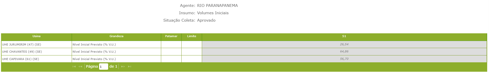

Para se obter o valor de volume do reservatório em hm³, a partir do valor da cota de montante prevista/verificada, é necessário utilizar o polinômio cota-volume, disponível no *hidr.dat*. A partir desse valor, para se determinar o volume útil do reservatório, também em hm³, basta subtrair o volume mínimo (morto), que é um dado de cadastro. Por fim, para se converter o volume útil obtido de hm³ para %VU, é preciso dividir o volume útil pelo volume útil total da usina, dado pela diferença entre o volume máximo e mínimo (morto), ambos dados de cadastro. Na Figura 10, é disponibilizada uma representação de um exemplo de reservatório, com suas cotas e volumes:

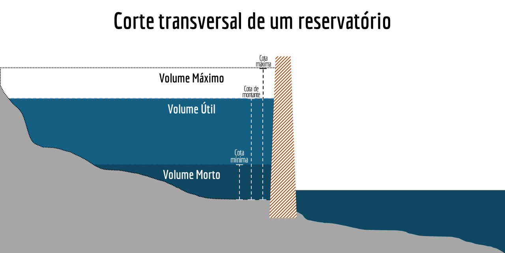

No modelo DECOMP, este insumo é alocado no arquivo *dadger*, em seu Bloco UH (Bloco 3 - Volume dos Reservatórios). Na Figura 11, pode ser vista a representação dos volumes de partida do mesmo agente mostrado na Figura 9 para os reservatórios de Jurumirim, Chavantes e Capivara. As demais UHEs deste Agente apresentam valor nulo de volume inicial, pois correspondem a reservatórios de regulação diária, que são fio d'água no DECOMP.

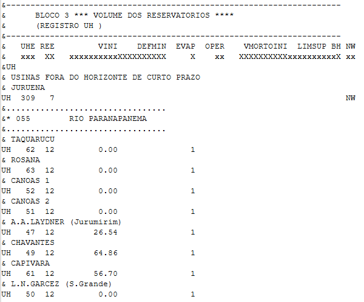

A representação das colunas é dada por:

- **Coluna 1-2:** Identificação do registro: UH;
- **Coluna 5-7:** Número da usina hidráulica conforme registro 303 do arquivo de vazões (UL=04);
- **Coluna 10-11:** Indice do reservatório equivalente de energia (REE) ao qual pertence a usina;
- **Coluna 15-24:** Volume armazenado inicial em percentagem do volume útil (default = 0.0 %) e
- **Coluna 40:** Chave para considerar evaporação, 0 - não considera (default) e 1 - considera.
- **Coluna 72-73:** Deve conter o conteúdo "NW" quando a usina não está na configuração do DECOMP, mas está na configuração do NEWAVE, de forma que o acoplamento entre os modelos fique compatível.

##### ::qr:images/image24.png:: Envio do Volume Inicial no WebPMO

A equipe do PMO disponibiliza um tutorial no YouTube explicando passo a passo de como fazer o envio deste insumo, disponível em <https://bit.ly/WebPMO_UH> e podendo ser acessado pelo QRcode ao lado. Alternativamente, seguem abaixo as instruções de envio:

<ol class="steps">
<li>Dentro do WebPMO, o Agente deverá selecionar o insumo "Volumes Iniciais" (passo 1), e então clicar em pesquisar (passo 2). Em seguida, selecionar o Agente no marcador (passo 3) e depois clicar em informar (passo 4).</li>
</ol>

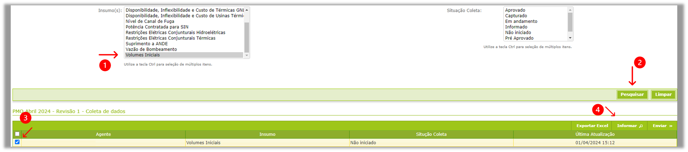

Após clicar em informar, o usuário será encaminhado para o envio do insumo, no qual poderá visualizar o formulário com as usinas do Agente que têm relação com o insumo selecionado, como pode-se observar na imagem abaixo. A indicação em vermelho mostra onde volume deve ser digitado, calculado em %VU, seguindo as instruções descritas nesta seção.

<p class="fig-caption-only"><span class="fig-num">Figura 13: </span>Aba dos Volumes Iniciais por usina.</p>

Preenchidas as informações de todas as usinas, o insumo pode ser diretamente enviado (passo 2) ou então pode ser salvo (passo 1) para posterior envio (passo 2), como mostra a figura a seguir.

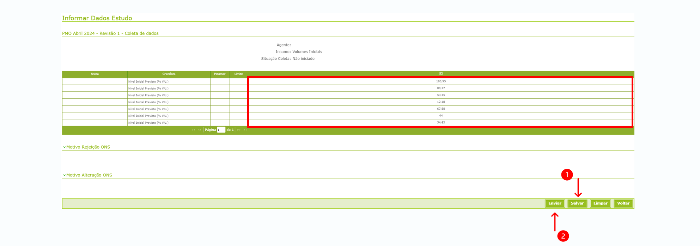

#### 4.1.2. Cronograma de manutenção das usinas hidrelétricas

O insumo de cronograma de manutenções em usinas hidrelétricas contém as manutenções programadas para as unidades geradoras das UHEs durante o horizonte do estudo. Tais indisponibilidades das unidades geradoras devem estar associadas a SGIs cadastrados no sistema [SGI-OP](http://sgi-op.ons.org.br/SGIOPWeb/AgendaIntervencoes) (Sistema de Gestão de Intervenções).

A Figura 15 a seguir mostra um exemplo de formulário com cronograma atualizado de manutenção em usinas hidrelétricas, com: identificação da usina e da unidade geradora com sua potência nominal, número de SGI da intervenção, data de início e fim da manutenção, indicação do tempo mínimo necessário para retorno da UG, motivo da realização da intervenção, sua situação no fluxo de aprovação do SGI-OP e indicação se a intervenção é relacionada a equipamentos de geração/produção (P), transmissão (T) ou ambos (A).

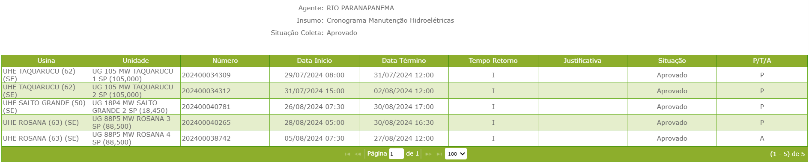

As intervenções aptas a serem consideradas no insumo de cronograma de manutenção em hidrelétricas são as:

- Com início até o final dos estágios semanais e com término depois do início do período de estudo;
- Caracterizadas como **"com desligamento"** – as manutenções "sem desligamento" e "para realização de testes" não afetam no cálculo de disponibilidade;
- Com status diferente de **"cancelada"**, **"concluída"** ou **"indeferida"** e
- De periodicidade **contínua** ou **diária**.

Manutenções ocorridas a partir do segundo mês de estudo não precisam constar na declaração, pois, para o segundo mês, a disponibilidade média das usinas é dada por taxas de indisponibilidade forçada (TEIF) e programada (TEIP) no **Bloco FD** (Bloco 20 - Fator de disponibilidade de usina hidráulicas). As manutenções declaradas iniciadas durante o segundo mês são desconsideradas e as que ocorrem no primeiro e segundo meses têm impacto considerado apenas no primeiro mês. No final da presente seção, essa questão é novamente abordada no detalhamento do Bloco FD.

Mensalmente, após a Reunião Mensal de Manutenção em Unidades Geradoras, que ocorre na semana anterior à semana de elaboração do PMO, os Agentes de Geração devem compatibilizar as manutenções cadastradas no sistema com a Ata da Reunião, documento resultante da reunião mensal entre a Equipe de Intervenções Energéticas e os Agentes interessados em realizar manutenções em suas máquinas. Dessa forma, garante-se a utilização no PMO do cronograma de intervenções em unidades geradoras mais atualizado possível.

As manutenções aptas a serem representadas no DECOMP são modeladas através de taxas de disponibilidade para cada usina em cada estágio, levando-se em consideração o período da manutenção da unidade e sua respectiva potência indisponível no estágio conforme a formulação a seguir para **uma usina em um determinado estágio**:

```math
\text{Fator de Disponibilidade} = \frac{\text{Potência Instalada} - \text{Potência Indisponível}}{\text{Potência Instalada}}
```

Em que:

```math
\text{Potência Instalada} = \sum_{\text{máquinas}} \text{Potência}_{\text{máquina}}
```

```math
\text{Potência Indisponível} = \sum_{\text{máquinas}} \frac{\text{Tempo Indisponível}_{\text{máquina}}}{\text{Tempo total}} \times \text{Potência}_{\text{máquina}}
```

`$\text{Potência}_{\text{máquina}}$`: Potência efetiva da unidade geradora

`$\text{Tempo Indisponível}_{\text{máquina}}$`: Tempo (em horas e minutos) que a unidade geradora ficou indisponível por conta das intervenções, ou seja, tempo decorrido fora de operação no estágio

`$\text{Tempo total}$`: Total de tempo do estágio (em horas e minutos)

As taxas de disponibilidade média calculadas são informadas no Bloco MP (Bloco 18 - Manutenções Hidráulicas Programadas) do arquivo *dadger*, conforme ilustrado no quadro a seguir. Ressaltamos que o valor padrão de 1.000 será sempre aplicado nas semanas em que não foi declarada manutenção, indicando disponibilidade total da usina.

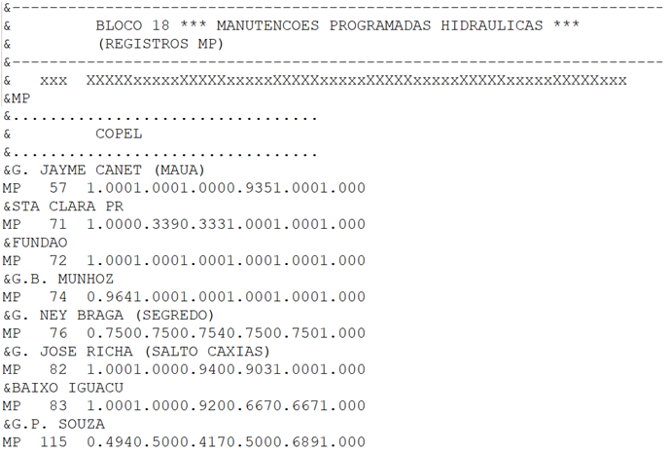

A representação das colunas é dada por:

- **Coluna 1-2:** Identificação do registro: MP;
- **Coluna 5-7:** Número da usina conforme campo 2 dos registros UH;
- **Coluna 8-9:** Caso a usina do campo 2 seja Itaipu e o registro RI estiver ativo, o campo 3 pode conter a informação do conjunto onde será aplicada manutenção, 50 - manutenção aplicada no conjunto 50Hz e 60 - manutenção aplicada no conjunto 60Hz e
- **Coluna 10-94:** Fatores de disponibilidade da usina para os N estágios.

Para demonstrar a forma de cálculo, pode ser tomado um exemplo para a UHE Jayme Canet (usina 57, com um conjunto de três máquinas de 117,4 MW cada, totalizando 352,2 MW, de acordo com o *hidr.dat*, conforme Figura 17) levando-se em conta o PMO de Agosto de 2026.

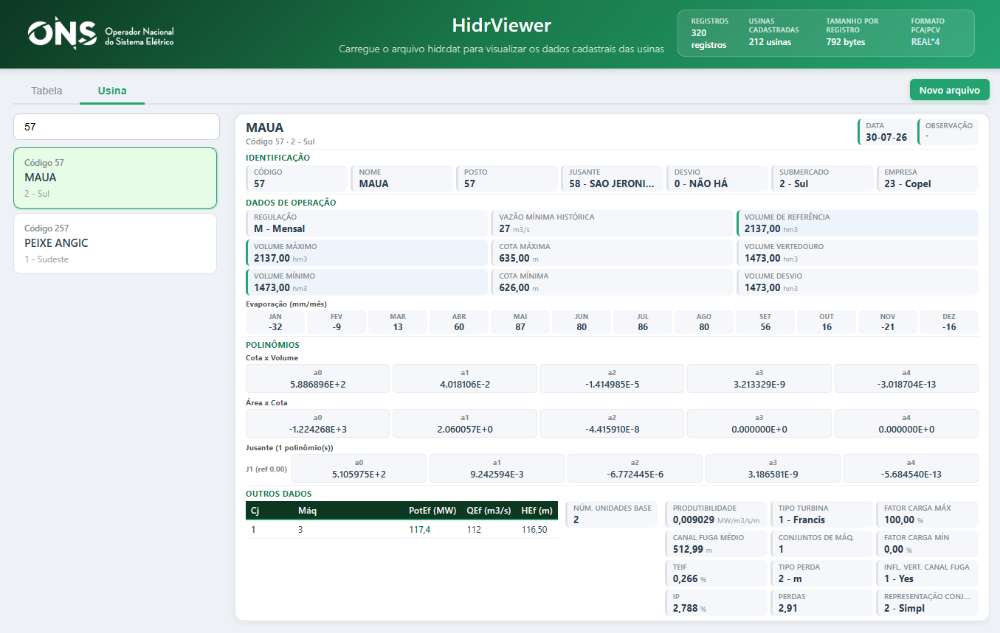

A usina apresentava uma manutenção programada para uma de suas UGs de 27/08/2026 às 08:00 até 28/08/2026 as 17:00, conforme pode ser observado na Figura 18. Dessa forma, o estágio que será afetado neste caso é o S4 (22/08/2026 a 28/08/2026), por isso o valor a ser calculado para esta manutenção ficará nas colunas 25-30 do Bloco MP.

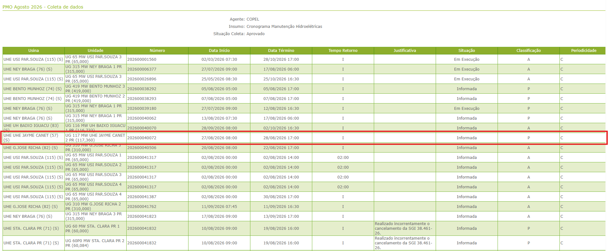

A partir da formulação apresentada anteriormente, o fator de disponibilidade será 0,935 para o estágio S4, como observado na representação do arquivo *dadger* da Figura 16. Os demais estágios permanecem como 1.000, haja vista que não foram informadas manutenções para as outras datas do período. O detalhamento do exemplo, com a memória de cálculo para se chegar ao valor de 0,935 pode ser consultada no Anexo I.1.

Para o estágio mensal, última coluna dos N estágios do bloco, é atribuída sempre disponibilidade plena (1.000) no bloco MP, pois sua representação é feita no Bloco FD, de acordo com a metodologia vigente do PMO.

O cálculo do fator de disponibilidade do Bloco FD leva em conta as TEIF e IP calculadas para cada usina com base em seu histórico de indisponibilidades nos últimos 12 meses. Tais valores constam em cadastro de usinas no arquivo *hidr.dat* e são atualizados anualmente, no PMO de Maio. Sua fórmula de cálculo é dada por `$(1 - TEIF) \times (1 - TEIP)$`.

A seguir um extrato do bloco FD no arquivo *dadger*.

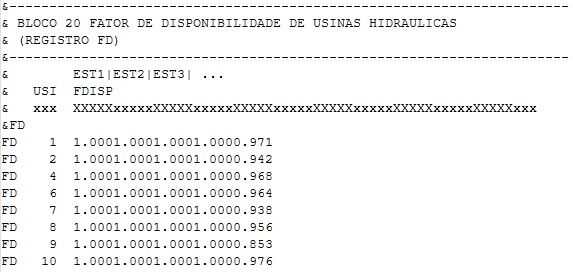

A representação das colunas é dada por:

- **Coluna 1-2:** Identificação do registro: FD;
- **Coluna 5-7:** Número da usina conforme campo 2 dos registros UH;
- **Coluna 8-9:** Caso a usina do campo 2 seja Itaipu e o registro RI estiver ativo, o campo 3 pode conter a informação do conjunto onde será aplicada a disponibilidade;
- **Coluna 10-94:** Fatores de disponibilidade da usina para os N estágios.

##### Envio do Cronograma Manutenção Hidrelétrica no WebPMO

<p class="u"><u>Semanas de PMO</u></p>

Nas semanas de elaboração do PMO, o insumo "Cronograma de Manutenção Hidrelétrica" assumirá automaticamente o status "Capturado" na segunda-feira às 09h, no momento da abertura da coleta, permanecendo indisponível para edição manual pelo Agente. Para indicar essa situação, ao clicar no insumo para visualizá-lo, a seção "Motivo Alteração ONS" contará com o comentário "Insumo capturado para análise do ONS". Às 16h do mesmo dia, o sistema realizará a consulta automática ao SGI-OP, identificará as intervenções aplicáveis ao estudo, preencherá o insumo e efetuará sua aprovação automática. Nesse momento, a seção "Motivo Alteração ONS" passará a conter um comentário informando "Insumo preenchido com dados do SGI-OP em DD/MM/2026 16:00".

Após essa atualização, o usuário deverá acessar o WebPMO e verificar as informações consideradas no insumo. Para a consulta, o usuário deverá selecionar o insumo "Cronograma Manutenção Hidrelétricas" (passo 1), clicar em Pesquisar (passo 2) e clicar com o botão esquerdo do mouse no nome do Agente (passo 3), para visualizar as manutenções preenchidas pelo sistema.

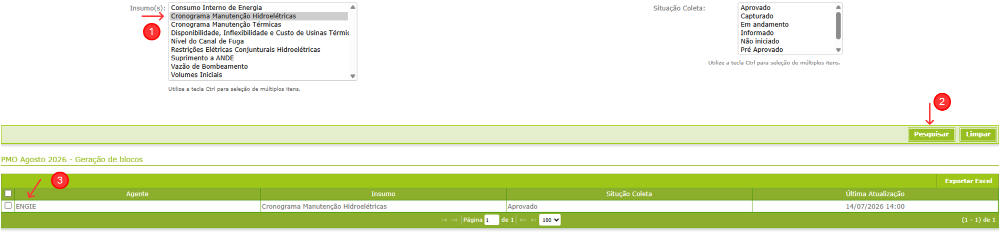

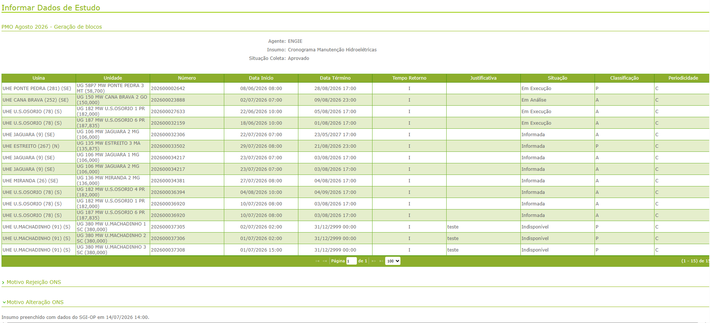

Caso identifique divergência ou necessidade de atualização, o usuário deverá priorizar a correção diretamente pelo SGI-OP, de forma que a informação atualizada esteja disponível para a nova consulta automática do sistema.

Na quarta-feira, às 16h, o WebPMO realizará uma nova consulta ao SGI-OP, atualizando o insumo com as informações mais recentes e efetuando novamente sua aprovação automática.

Após essa segunda atualização, o usuário deverá consultar as informações preenchidas novamente, conforme a Figura 20 e a Figura 21. Caso permaneça alguma necessidade de ajuste excepcional, o usuário deverá entrar em contato com a Equipe do PMO para avaliação e tratamento do caso.

<p class="u"><u>Semanas de Revisão do PMO</u></p>

Nas semanas de Revisão do PMO, o insumo "Cronograma de Manutenção Hidrelétrica" será automaticamente capturado pelo sistema na quarta-feira às 09h, no momento da abertura da coleta, permanecendo indisponível para edição manual pelo Agente. Às 11h de quinta-feira, o sistema realizará a consulta automática ao SGI-OP, identificará as intervenções aplicáveis e efetuará o preenchimento e a aprovação automática do insumo.

Após a atualização, o usuário deverá acessar o WebPMO para conferir as informações consideradas no insumo. Para a consulta, o usuário deverá seguir os mesmos passos citados através da Figura 20 e da Figura 21.

Caso seja identificado algum ajuste necessário após o processamento automático, o usuário deverá entrar em contato com a Equipe do PMO para avaliação e tratamento do caso.

Em situações excepcionais, tanto em semanas de PMO quanto em semanas de Revisão, a Equipe do PMO poderá autorizar alterações manuais no insumo.

Nesses casos, o Agente deverá selecionar o insumo "Cronograma Manutenção Hidrelétricas" (passo 1), clicar em Pesquisar (passo 2), selecionar o Agente no marcador (passo 3) e depois clicar em Informar (passo 4).

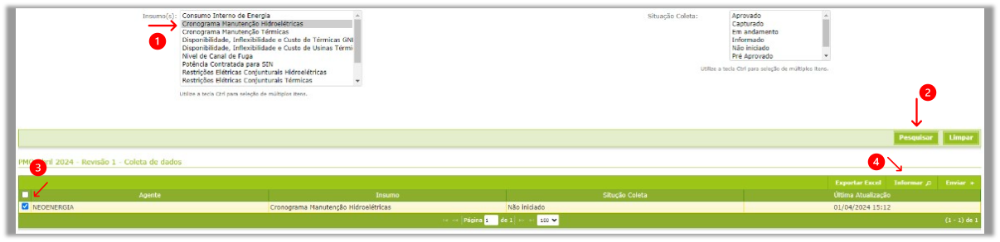

Após acessar o formulário, o usuário deverá clicar em "Obter Manutenções", que apresentará todas as intervenções cadastradas no SGI-OP para as usinas de sua responsabilidade. O usuário deverá selecionar (passo 1) todas aquelas que se enquadram para o cálculo de disponibilidade como descrito neste capítulo.

Após a seleção das intervenções, as informações podem ser salvas (passo 2).

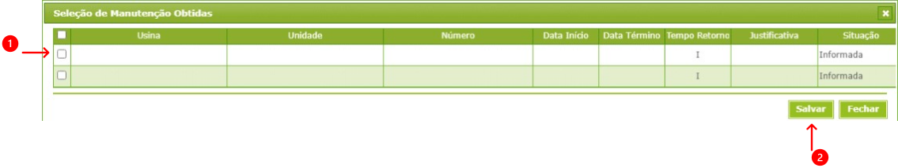

Após salvar as informações, o insumo deve ser enviado.

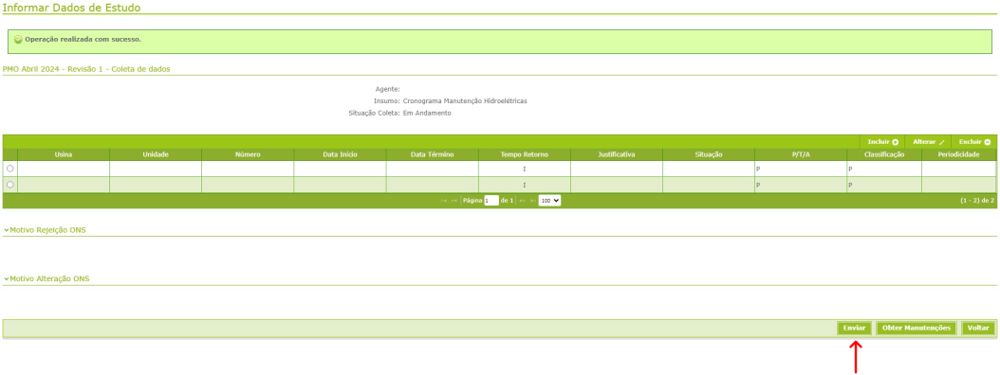

Após o envio, caso ainda haja algum problema com o insumo enviado, como um SGI indeferido após a declaração ou incompatibilidade com a Ata de Manutenção, a equipe do PMO entrará em contato com o usuário para validar o que foi declarado.

#### 4.1.3. Restrições elétricas conjunturais das usinas hidroelétricas

Para representar limitações operacionais de usinas e limites de intercâmbio, utiliza-se o Bloco RE de restrições elétricas no modelo DECOMP. Como exemplos dessas limitações para a geração de usinas, cita-se a geração mínima para se evitar cavitação / vibração excessiva e a geração máxima por conta de alguma restrição temporária não cadastrada em SGI. No caso de fluxos de intercâmbio, os limites estruturais e conjunturais de transferência de energia entre os subsistemas também são representados no Bloco RE.

Essas restrições são representadas por inequações:

```math
LI_{T} \leq G_{T} \leq LS_{T}
```

Onde `$LI_{T}$` é o limite inferior, `$LS_{T}$` é o limite superior e `$G_{T}$` é a geração de energia da usina no estágio T.

A formulação destas inequações permite impor limites sobre a geração das usinas hidráulicas, indicando faixas operativas referentes a condições conjunturais.

No WebPMO, conforme será visto mais adiante, estes limites devem ser fornecidos em "MWmed" por estágio e patamar de carga (pesada, média e leve), conforme ilustrado no exemplo de coleta a seguir.

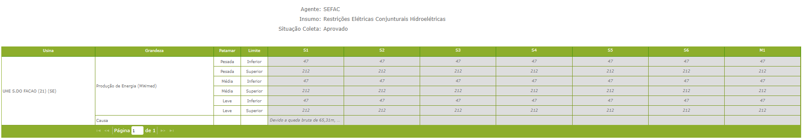

Neste exemplo, pode-se observar que a UHE Serra do Facão tem uma restrição de geração mínima de 47 MWmed e máxima de 212 MWmed para todos os patamares de carga e em todos os estágios operativos, devido à previsão de altura de queda. Destaca-se que é importante que o Agente justifique os limites no campo "Causa".

Estas informações compõem o Bloco RE (Bloco 23 – Restrições Elétricas). As restrições elétricas são introduzidas por meio dos registros RE, LU e FU, sempre considerando na descrição dos dados, o patamar 1 para carga pesada, o patamar 2 para carga média e o patamar 3 para carga leve. O quadro a seguir ilustra a descrição da restrição coletada neste exemplo.

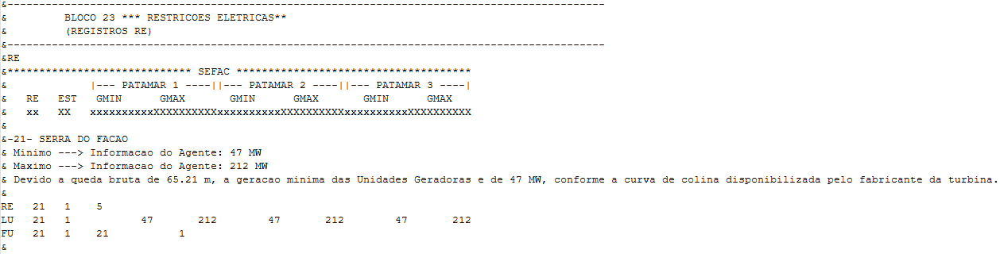

A representação das colunas do registro RE é dada por:

- **Coluna 1-2:** Identificação do registro: RE;
- **Coluna 5-8:** Número de identificação da restrição elétrica;
- **Coluna 10-11:** Estágio inicial da restrição;
- **Coluna 15-16:** Estágio final da restrição.

A representação das colunas do registro LU é dada por:

- **Coluna 1-2:** Identificação do registro: LU;
- **Coluna 5-8:** Número da restrição elétrica conforme campo 2 do registro RE;
- **Coluna 10-11:** Número do estágio, em ordem crescente;
- **Coluna 15-24:** Limite inferior em MWmed para o patamar 1;
- **Coluna 25-34:** Limite superior em MWmed para o patamar 1;
- E assim segue para os demais patamares.

A representação das colunas do registro FU é dada por:

- **Coluna 1-2:** Identificação do registro: FU;
- **Coluna 5-8:** Número de identificação da restrição elétrica conforme campo 2 do registro RE;
- **Coluna 10-11:** Número do estágio em ordem crescente;
- **Coluna 15-17:** Número da usina hidráulica conforme campo 2 dos registros UH;
- **Coluna 20-29:** Fator de participação da usina;
- **Coluna 31-32:** 50 ou 60 se a restrição for referente a Itaipu.

##### Envio das restrições elétricas conjunturais no WebPMO

Dentro do WebPMO, o Agente deverá selecionar o insumo "Restrições Elétricas Conjunturais Hidroelétricas" (passo 1) e então clicar em "Pesquisar" (passo 2). Selecionar o Agente no marcador (passo 3) e depois ir em informar (passo 4).

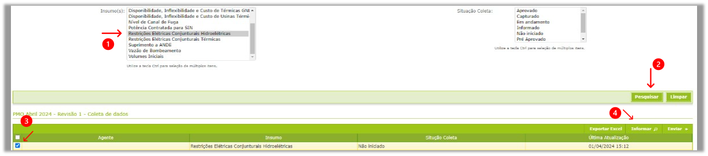

Em seguida, o usuário será encaminhado para a tela abaixo, contendo todas as usinas do Agente. Caso as restrições elétricas sejam iguais às da semana anterior, o usuário poderá recuperar a informação enviada (passo 1 da tela a seguir). Esta funcionalidade só poderá ser usada em revisões, uma vez que em semanas de PMO há novas semanas a preencher. Caso o Agente queira inserir manualmente ou caso as informações não sejam iguais às anteriores, o usuário poderá preencher as informações seguindo as especificações descritas neste capítulo e então salvar o formulário (passo 2) e depois enviar o dado para análise (passo 3).

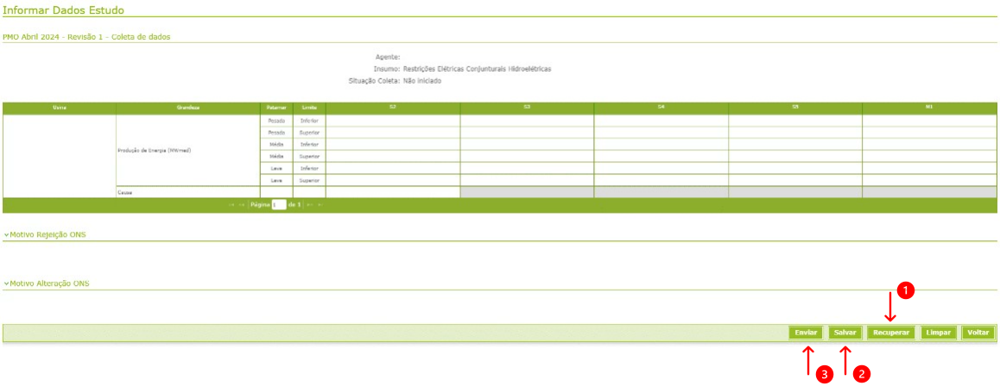

### 4.2. Usinas termelétricas

#### 4.2.1. Cronograma de manutenção das usinas térmicas

As informações do cronograma de manutenção das usinas térmicas são utilizadas como insumo para as declarações de **disponibilidade de geração de usinas termelétricas,** uma vez que as disponibilidades declaradas já devem considerar todas as restrições operativas e todas as manutenções previstas para o período (este tópico será abordado na seção 4.2.2).

Diferentemente do insumo de Cronograma de Manutenção em Usinas Hidrelétricas, para este insumo das Usinas Térmicas deverão ser informadas <u>todas</u> as manutenções caracterizadas como "**com desligamento**" para todo o horizonte de estudo. As demais manutenções (SGIs "sem desligamento" ou "para realização de testes", por exemplo) que restrinjam a operação de uma unidade geradora devem ser informadas no campo de comentários do insumo da disponibilidade.

Os campos das grandezas coletadas estão ilustrados a seguir.

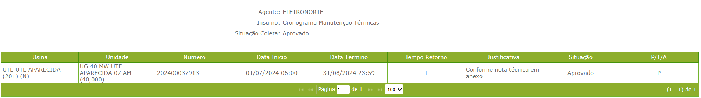

##### Envio do Cronograma Manutenção Térmica no WebPMO

Dentro do WebPMO, o Agente deverá selecionar o insumo "Cronograma Manutenção Térmica" (passo 1), e então ir em pesquisar (passo 2). Selecionar o Agente no marcador (passo 3) e depois ir em informar (passo 4).

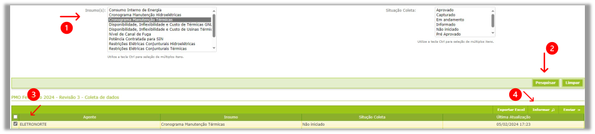

Após, clicar em informar, o usuário poderá ver todas as manutenções que estão cadastradas no sistema SGI-OP de posse deste Agente e, então, deverá selecionar (passo 1) todas aquelas que se enquadram para o cálculo de disponibilidade como descrito neste capítulo (recomenda-se que o Agente selecione todas as manutenções desta aba). Após a seleção, as informações devem ser salvas (passo 2).

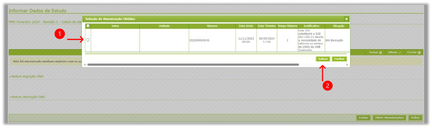

Selecionado e salvado as informações, o insumo deve ser enviado.

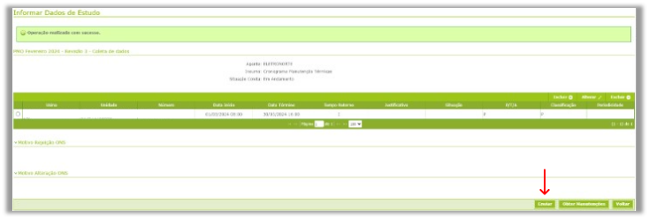

#### 4.2.2. Disponibilidade, Inflexibilidade e Custo de Usinas Térmicas

A disponibilidade de geração de usinas termelétricas é valor máximo que a usina pode gerar efetivamente, e, para este cálculo, devem ser levadas em consideração:

- O **fator de capacidade**;
- As **manutenções** previstas para o período do estudo;
- As **restrições operativas**;
- A **rampa** de subida de acionamento da usina geradora (opcional).

O valor da **disponibilidade** deve ser fornecido para cada **estágio** e por **patamar de carga** em **MWmed**, ou seja, o cálculo patamarizado leva em conta a duração horária das indisponibilidades e sua relação com intervalos de cada patamar para cada semana e mês do período do PMO e suas revisões, conforme referência anual disponibilizada no SINtegre, no produto [Intervalo dos Patamares de Carga](https://sintegre.ons.org.br/sites/9/47/paginas/servicos/historico-de-produtos.aspx?produto=Intervalos%20dos%20Patamares%20de%20Carga) [6].

Nesse sentido, é importante destacar que os intervalos dos patamares de determinado ano começam a ser utilizados a partir do PMO de Janeiro, de forma que não haja duas referências de intervalos de patamar de carga em um mesmo estudo. Por exemplo: no PMO de Dezembro de 2024 é utilizada a referência de 2024 para os dois meses de estudo, enquanto que, para o PMO de Janeiro de 2025, é utilizada apenas a referência de 2025 para todo o horizonte (mesmo para os dias de 2024).

A **inflexibilidade** reflete o valor de geração inflexível (mínima) de determinada usina termelétrica, declarado pelo agente proprietário para atender requisitos deste. Os valores devem ser fornecidos em **MWmed** para cada **patamar de carga** e cada **estágio**.

O Custo Variável Unitário - **CVU** de geração representa o custo associado à produção de uma unidade de energia elétrica em determinada usina termelétrica. Atualmente, este valor é único para todos os patamares de carga do período de estudo e deve ser fornecido em R$/MWh. É importante ressaltar que **sua declaração no WebPMO é opcional e, caso o campo esteja em branco, o ONS utilizará o CVU regulado como dado de entrada no modelo.** Caso seja de interesse do Agente, pode ser declarado no WebPMO um CVU menor do que o regulado, conforme previsto pelo §1º do Art.10 da Resolução Normativa ANEEL Nº 1.032/2022 [1], com duração mínima de um estágio e máxima até o último estágio semanal. Para o segundo mês de estudo, é feita a compatibilização com o modelo de médio prazo, utilizando-se o CVU regulado. Para mais informações sobre o assunto, [acessar a notícia publicada pela Programação Mensal da Operação Energética no SINtegre](https://sintegre.ons.org.br/Paginas/servicos/noticiasdetalhe.aspx?noticiaId=6538&url).

Adicionalmente, ao final do formulário do insumo no WebPMO, há um campo para comentários, em que devem ser informados os motivos para a declaração de disponibilidade inferior à capacidade máxima da usina em casos que não envolvem manutenções declaradas no insumo Cronograma de Manutenção em Usinas Térmicas. Neste campo, também pode ser reforçada a intenção de declarar um CVU inferior ao regulado ou justificar determinada inflexibilidade declarada.

A figura abaixo traz um exemplo de formulário preenchido para o insumo "Disponibilidade, Inflexibilidade e Custo de Usinas Térmicas".

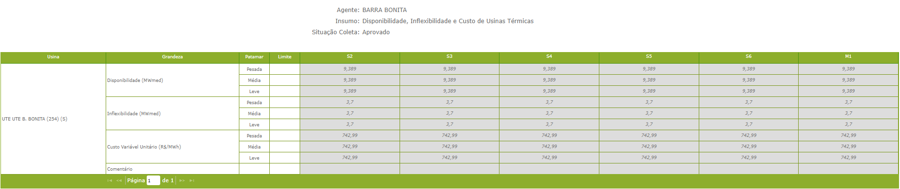

As informações de usinas termelétricas informadas no WebPMO compõem o Bloco CT (Bloco 4 – Cadastro UTE), do arquivo *dadger*, conforme ilustrado no quadro a seguir.

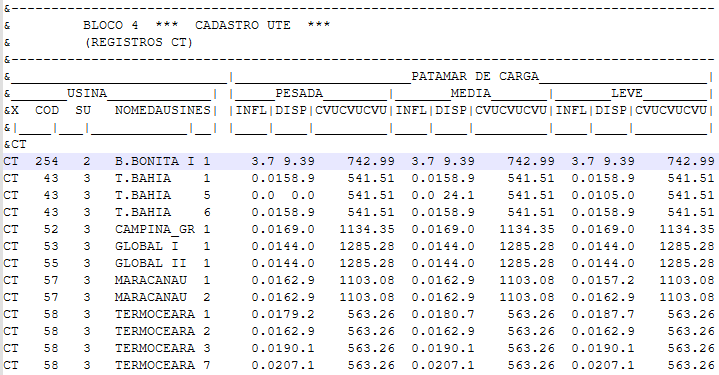

A representação das colunas é dada por:

- **Coluna 1-2:** Identificação do registro: CT;
- **Coluna 5-7:** Número da usina termelétrica;
- **Coluna 10-11:** Índice do subsistema ao qual pertence a usina;
- **Coluna 15-24:** Nome da usina termelétrica;
- **Coluna 25-26:** Índice do estágio;
- **Coluna 30-34:** Geração mínima fixa da usina, em MWmed, no patamar 1;
- **Coluna 35-39:** Capacidade de geração da usina, em MWmed, no patamar 1;
- **Coluna 40-49:** Custo de geração da usina termelétrica, em $/MWh, no patamar 1;
- E assim sucessivamente para os demais patamares.

No exemplo acima, do Bloco CT, a UTE Barra Bonita (usina 254) apresenta inflexibilidade de 3,7 MWmed, disponibilidade de 9,39 MWmed e CVU de 742,99 R$/MWh para todos os patamares de carga, conforme visto também na declaração do WebPMO na Figura 36. Como os valores declarados se repetem em todos os estágios, apenas o registro do primeiro estágio é escrito no Bloco CT, com a repetição para os demais ficando subentendida pelo modelo. No caso da UTE Maracanaú (usina 57), há um registro para o estágio 1 e outro para o estágio 2, que permanece para os demais estágios do estudo.

Para auxiliar no cálculo dos dados de grandezas patamarizadas do DECOMP, e consequentemente no preenchimento de insumos no WebPMO, como o formulário de Disponibilidade, Inflexibilidade e CVU, a equipe do PMO disponibiliza anualmente uma planilha que pode ser usada como base, disponível no produto do SINtegre de "[Ferramentas Auxiliares para o PMO](https://sintegre.ons.org.br/sites/9/52/paginas/servicos/historico-de-produtos.aspx?produto=Ferramentas%20Auxiliares%20para%20o%20PMO)" [7]. Neste produto, há uma planilha "CargaPatamar" que apresenta a distribuição horária dos patamares de carga para todos os dias do ano, mostrada em maiores detalhes na seção Anexo I.2.

A seguir, é trazido um exemplo de cálculo de disponibilidade para uma usina fictícia com as seguintes características:

- Capacidade instalada: **100 MW**
- Unidades geradoras: **4 x 25 MW**
- Fator de capacidade: **97%**
- Restrições operativas: **nenhuma**
- Manutenções:

| Início | Fim | Equipamento | Caracterização | Restrição | Periodicidade | Status |
|---|---|---|---|---|---|---|
| 07/01/2025 - 8:00 | 13/01/2025 - 18:00 | UG1 25 MW UTE FICTICIA | Com desligamento | - | Contínua | Aprovada |
| 20/12/2024 - 8:00 | 13/01/2025 - 18:00 | UG2 25 MW UTE FICTICIA | Sem desligamento | 8 MW | Contínua | Aprovada |

<p class="tbl-cap">Tabela 3 - Lista de manutenções na usina termelétrica fictícia</p>

Ressalta-se que a manutenção na UG1 deve ser informada no insumo "Cronograma de manutenções térmicas", pois é caracterizada como "com desligamento", enquanto a manutenção na UG2, caracterizada como "sem desligamento", não deve ser informada neste insumo. No entanto, seu impacto deve ser considerado no cálculo da disponibilidade e devidamente registrado no campo de comentários do formulário "Disponibilidade, Inflexibilidade e Custo das Usinas Térmicas". Para o exemplo dado, imagina-se hipoteticamente que a intervenção na UG1 soluciona a restrição de 8 MW observada na UG2.

Os dados de fator de capacidade, eventuais restrições operativas, e intervenções caracterizadas como "sem desligamento" que interfiram na geração, devem ser considerados no cálculo da disponibilidade e **informados no campo de comentários** do formulário.

Sendo assim, levando-se em conta o horizonte de estudo para o PMO de Janeiro de 2025, realizando o cálculo de disponibilidade para cada patamar de carga em cada estágio, por meio da média dos valores em cada um deles, se chega aos seguintes valores:

| Patamar\Estágio | S1 | S2 | S3 | S4 | S5 | M1 |
|---|---|---|---|---|---|---|
| Pesado | 89,2 | 69,8 | 94,6 | 97,0 | 97,0 | 97,0 |
| Médio | 89,2 | 74,9 | 85,1 | 97,0 | 97,0 | 97,0 |
| Leve | 89,2 | 81,9 | 78,0 | 97,0 | 97,0 | 97,0 |

<p class="tbl-cap">Tabela 4 - Disponibilidade da usina por estágio e patamar de carga para o exemplo</p>

O detalhamento dos valores considerados para cada hora, para todo o horizonte de estudo, se encontra na seção Anexo I.2, com a utilização da planilha "CargaPatamar".

##### Envio da Disponibilidade, Inflexibilidade e Custo de Usinas Térmicas no WebPMO

Dentro do WebPMO, o usuário deverá selecionar o insumo "Disponibilidade, Inflexibilidade e Custo de Usinas Térmicas" (passo 1), e então clicar em pesquisar (passo 2), selecionar o Agente no marcador (passo 3) e depois clicar em informar (passo 4).

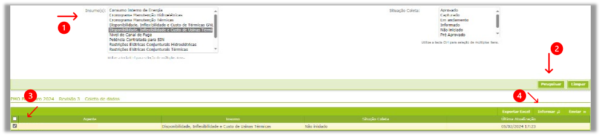

Após clicar em informar, o usuário será encaminhado para a tela abaixo com todas as UTEs de propriedade do Agente selecionado. Caso os dados a serem informados sejam iguais aos da semana anterior, o usuário poderá repeti-los ao clicar no botão "Recuperar" e, em seguida, em "Enviar". Ressalta-se que, em semanas de elaboração do PMO, não é possível recuperar dados, uma vez que o horizonte de estudo é modificado. Caso as informações prestadas tenham alteração com relação à semana anterior, o usuário poderá preenchê-las como especificado nesta seção, clicar em "Salvar" e depois em "Enviar", para que o formulário seja analisado pela equipe do PMO.

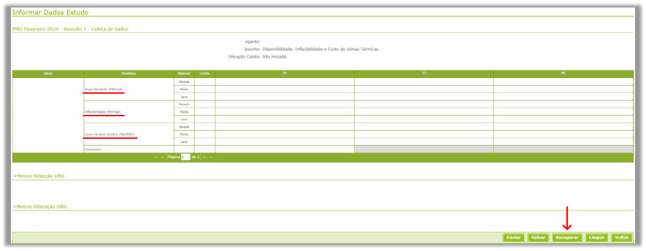

#### 4.2.3. Disponibilidade, Inflexibilidade e Custo de Térmicas GNL

Este formulário é análogo ao anterior, sendo o horizonte da informação a única diferença. Como o despacho das usinas termelétricas a GNL é realizado com nove semanas de antecedência pelo modelo DECOMP, a disponibilidade de tais usinas (no momento, UTEs Santa Cruz e Porto Sergipe) deve ser informado para o horizonte que contempla as semanas operativas do PMO e mais os três meses subsequentes (dois estágios mensais a mais além do estágio mensal já existente no estudo), a fim de completar as nove semanas do despacho antecipado.

Os campos das grandezas coletadas estão ilustrados a seguir.

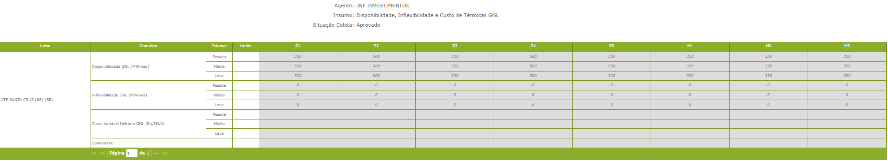

Estas informações compõem o Bloco TG (Bloco 1 – Térmicas a GNL) do arquivo *dadgnl*, conforme ilustrado no quadro a seguir, onde, por exemplo, a usina 86 (UTE Santa Cruz) apresenta valores de inflexibilidade 0 MWmed e disponibilidade de 500 MWmed para todos os patamares de carga (pesada, média e leve) nos estágios 1-5 e disponibilidade de 350 MWmed nos estágios a partir do 6, conforme envio do Agente. Como o campo de CVU do formulário se encontra em branco, **é utilizado no arquivo de entrada o CVU regulado.**

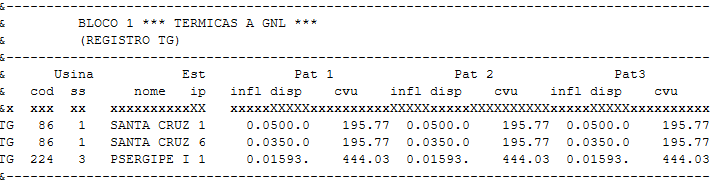

A representação das colunas é dada por:

- **Coluna 1-2:** Identificação do registro: **TG**;
- **Coluna 5-7:** Número da usina termelétrica GNL;
- **Coluna 10-11:** Indice do subsistema ao qual pertence a usina;
- **Coluna 15-24:** Nome da usina termelétrica GNL;
- **Coluna 25-26:** Indice do estágio;
- **Coluna 30-34:** Geração mínima fixa da usina, em MWmed, no patamar 1;
- **Coluna 35-39:** Capacidade de geração da usina, em MWmed, no patamar 1;
- **Coluna 40-49:** Custo de geração da usina termelétrica, em $/MWh, no patamar 1.

O cálculo de disponibilidade das usinas GNL se dá de forma análoga ao exemplo das termelétricas da seção 4.2.2, bastando **adicionar mais dois meses** ao horizonte do estudo.

### 4.3. Insumos específicos

#### 4.3.1. Nível de Canal de Fuga (UHE Tucuruí)

O insumo "Nível do Canal de Fuga" é coletado apenas para a UHE Tucuruí, pois esta usina hidráulica possui uma modelagem refinada nos estudos do PMO.

A tela a seguir mostra um exemplo da coleta desses dados.

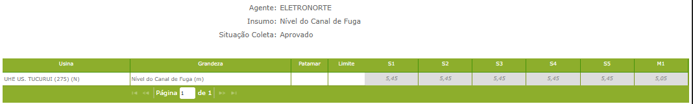

O dado do nível de canal de fuga declarado pelo agente deve ser fornecido em metros (m) para os dois meses de estudo, com apenas um único valor para o primeiro e outro para o segundo mês, sendo atualizado apenas no PMO seguinte. Tal valor deve ser compatibilizado em PMO com o modelo NEWAVE para os dois primeiros meses do estudo. Os demais meses de estudo no NEWAVE utilizam valores de canal de fuga médio de cadastro, encontrados no arquivo *hidr.dat*.

Estas informações são apresentadas no Bloco AC (Bloco 25 – Modificação do Cadastro), conforme ilustrado no quadro a seguir.

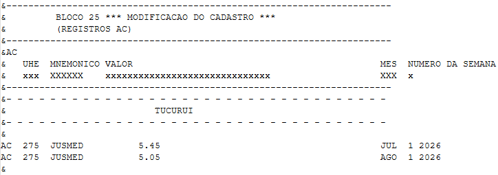

A representação das colunas é dada por:

- **Coluna 1-2:** Identificação do registro: AC;
- **Coluna 5-7:** Número da usina hidráulica conforme campo 2 dos registros UH;
- **Coluna 10-15:** Mnemônico para identificação do parâmetro a ser modificado;
  - JUSMED: Cota média do canal de fuga (metros).
- **Coluna 26-30:** Novo valor do(s) parâmetro(s);
- **Coluna 70-72:** Três primeiras letras do mês correspondente à alteração;
- **Coluna 75:** Número da semana do mês inicial a partir da qual deve se considerar a alteração e
- **Coluna 77-80:** Ano correspondente à alteração.

##### Envio do nível do canal de fuga no WebPMO

Dentro do WebPMO, o Agente deverá selecionar o insumo "Nível do Canal de Fuga" (passo 1), e então clicar em "Pesquisar" (passo 2). Em seguida, selecionar o Agente no marcador (passo 3) e depois clicar em "Informar" (passo 4).

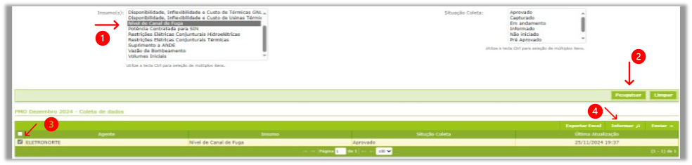

Em seguida, o usuário será encaminhado para a tela abaixo, somente com a UHE Tucuruí. Para este insumo, o Agente deve preencher valores mensais para os dois meses de estudo (passo 1 da tela a seguir). Após o preenchimento, o Agente pode clicar em "salvar" (passo 2) e depois em "enviar" (passo 3) ou então enviar diretamente o dado para análise.

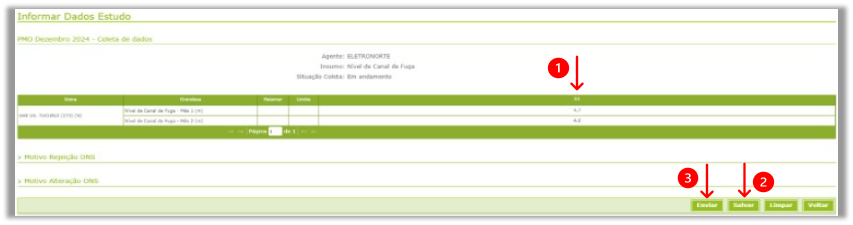

#### 4.3.2. Vazão de Bombeamento (Agente Light GT)

O insumo "vazão de bombeamento" é coletado apenas para o Agente Light GT, levando em conta a modelagem das usinas elevatórias de Santa Cecília e Vigário, que fazem a transposição da água do Rio Paraíba do Sul para região metropolitana do Rio de Janeiro.

A tela a seguir mostra um exemplo da coleta desses dados.

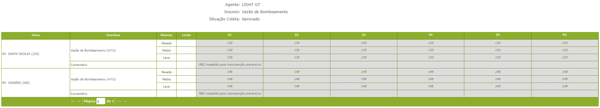

O dado de vazão de bombeamento deve ser declarado pelo agente em **metros cúbicos por segundo (m³/s) para os dois meses de estudo**, sendo o primeiro mês discretizado em semanas operativas e o segundo com um valor mensal único.

Esta informação, no formato de dado de cadastro, se encontra no arquivo *dadger*, no Bloco UE (Bloco 5 – Estações de Bombeamento). Como no caso do exemplo acima há uma especificação do agente sobre uma manutenção em uma das máquinas reversíveis, o valor da grandeza será menor que o cadastrado e incluído em uma restrição de vazão de bombeamento máxima (mnemônico QBOM).

Estas informações são apresentadas no arquivo *dadger*, no Bloco HQ (Bloco 36 – Restrições de vazão defluente), conforme ilustrado no quadro a seguir.

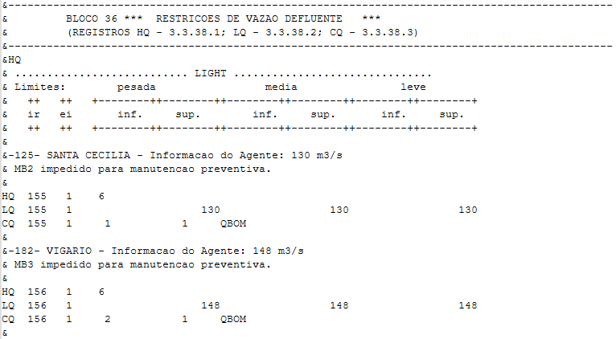

A representação das colunas é dada por:

- **Coluna 1-2:** Identificação do registro: CQ;
- **Coluna 5-7:** Número da restrição de Vazão, conforme campo 2 do registro HQ;
- **Coluna 10-11:** Número do estágio, em ordem crescente;
- **Coluna 15-17:** Número da usina hidrelétrica, conforme campo 2 do registro UH;
- **Coluna 20-29:** Coeficiente de cada variável na restrição RHQ e
- **Coluna 35-38:** QBOM – Vazão bombeada nas estações de bombeamento.

##### Envio da vazão de bombeamento no WebPMO

Dentro do WebPMO, o Agente deverá selecionar o insumo "Vazão de Bombeamento" (passo 1), então clicar em pesquisar (passo 2), selecionar o Agente no marcador (passo 3) e depois clicar em informar (passo 4).

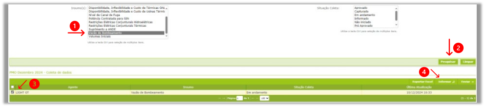

Em seguida, o usuário será encaminhado para a tela abaixo com as UHEs Santa Cecília e Vigário. Caso as restrições sejam iguais às da semana anterior, o usuário poderá recuperar a informação enviada clicando em "Recuperar Dados" (este dado só poderá ser usado em revisões, uma vez que em semanas de PMO há novas semanas a preencher, como no caso abaixo). Nesse caso o Agente deve preencher as informações manualmente, seguindo as especificações descritas neste capítulo, e então clicar em "salvar" (passo 1) e em "enviar" para que o dado seja enviado para análise (passo 2) ou diretamente clicando em "enviar" após o preenchimento.

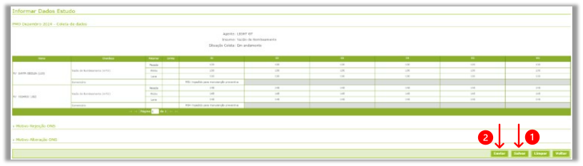

#### 4.3.3. UHE Itaipu

A usina hidrelétrica de Itaipu possui uma modelagem diferentes das demais usinas no modelo DECOMP. Itaipu é representada através de dois conjuntos de geração: o de 50 Hz, que está eletricamente conectado ao subsistema SE/CO através do elo de Furnas e à carga da ANDE no Paraguai, e o conjunto de 60 Hz, que está conectado ao nó de Ivaiporã. Mais detalhes sobre esta modelagem podem ser encontrados no manual de metodologia [8].

Dessa forma, para representação deste modelo no arquivo de entrada *dadger* é necessário que no WebPMO o Agente envie os seguintes insumos: **consumo interno de energia e suprimento a ANDE**.

O **consumo interno de energia** corresponde ao valor do próprio consumo de energia da usina considerando tanto Itaipu 50 Hz e 60 Hz, este deve ser informado **para todos os estágios operativos em MWmed**.

A tela a seguir mostra um exemplo da coleta desses dados.

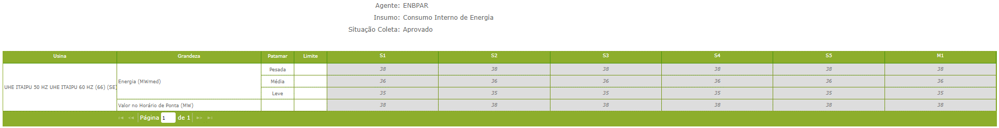

O **suprimento a ANDE** corresponde a carga do Paraguai e está incorporada à geração 50Hz. O Agente deve informar este dado **para todos os estágios operativos em MWmed**.

A tela a seguir mostra um exemplo da coleta desses dados.

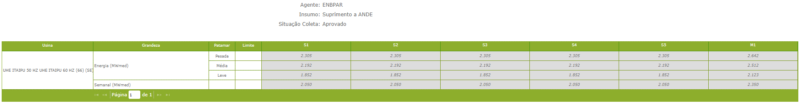

Na versão em uso do modelo DECOMP, estas informações são usadas para cálculo para uso no arquivo *dadger*, no Bloco 10 (Registro RI), este registro incorpora à representação dos limites máximo e mínimo para Itaipu 50 Hz e 60 Hz e a parcela desta geração relativa à carga da Ande, conforme ilustrado no quadro a seguir.

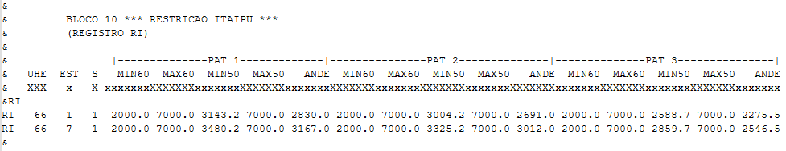

A representação das colunas é dada por:

- **Coluna 1-2:** Identificação do registro: RI;
- **Coluna 5-7:** Índice da usina de Itaipu (conforme campo 2 dos registros UH);
- **Coluna 9-11:** Identificação do estágio;
- **Coluna 13-15:** Índice do subsistema que representa o Sudeste;
- **Coluna 17-23:** Geração mínima de Itaipu_60 Hz, em MWmed, no patamar 1;
- **Coluna 24-30:** Geração máxima de Itaipu_60 Hz, em MWmed, no patamar 1;
- **Coluna 31-37:** Geração mínima de Itaipu_50 Hz, em MWmed, no patamar 1;
- **Coluna 38-44:** Geração máxima de Itaipu_50 Hz, em MWmed, no patamar 1;
- **Coluna 45-51:** Carga da Ande, em MWmed, no patamar 1;
- E assim segue para os demais patamares de carga.

Exemplificando, os valores de entrada no arquivo *dadger* no registro RI, temos:

- No mínimo para 60 Hz é considerado a geração mínima para evitar auto-excitação das unidades quando da atuação do SEP do 750 kV, assim como especificado no envio do WebPMO no insumo das Restrições Elétricas Conjunturais Hidrelétricas por parte do Agente;
- No mínimo para 50 Hz é dado pelo maior valor entre:

```math
M\acute{a}x\left(Carga\ de\ Ande + \frac{Consumo\ interno}{2} + (NC \times 78,3);\ 5\ UGs \times Gmin\right)
```

Onde, `$NC \times 78,3$` representa o valor mínimo do fluxo do bipolo de Ibiúna, sendo NC o número de conversores e, para faixas de potência inferiores a 945 MW é recomendado a operação com 4 conversores. O `$Gmin$` para esta faixa operativa em 50 Hz é de 500 MW;

- No máximo para 50 e 60 Hz é considerado a geração máxima de Itaipu, que são dadas por 10 máquinas de 700 MW, e, portanto, a geração é de 7.000 MW e
- O valor da carga de Ande será dada pela própria carga informada no WebPMO pelo Agente mais a metade do consumo interno de Itaipu.

##### Envio do consumo interno de energia

Dentro do WebPMO, o Agente deverá selecionar o insumo "Consumo Interno de Energia" (passo 1), e então ir em pesquisar (passo 2). Selecionar o Agente no marcador (passo 3) e depois ir em informar (passo 4).

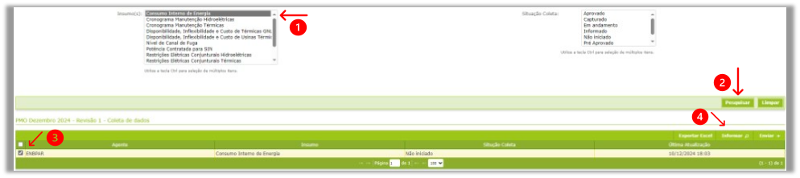

Após, clicar em informar, o usuário será encaminhado para a tela abaixo, onde terá somente a UHE Itaipu. Para este insumo, o Agente deve preencher o dado todas as semanas operativas do estudo e para o estágio mensal. Caso o envio não seja em semana de PMO o Agente conseguirá recuperar os dados, passo 1, e então, o Agente deve salvar, passo 2, e depois enviar o dado para análise, passo 3. Caso contrário, deverá ser realizado o preenchimento do insumo ao invés de recuperar e seguir os passos subsequentes.

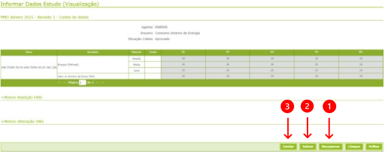

##### Envio do suprimento da ANDE

Dentro do WebPMO, o Agente deverá selecionar o insumo "Suprimento da ANDE" (passo 1), e então ir em pesquisar (passo 2). Selecionar o Agente no marcador (passo 3) e depois ir em informar (passo 4).

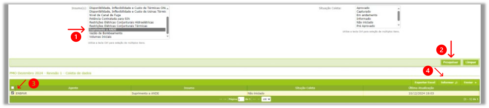

Após, clicar em informar, o usuário será encaminhado para a tela abaixo, onde terá somente a UHE Itaipu. Para este insumo, o Agente deve preencher o dado todas as semanas operativas do estudo e para o estágio mensal. Caso o envio não seja em semana de PMO o Agente conseguirá recuperar os dados, passo 1, e então, o Agente deve salvar, passo 2, e depois enviar o dado para análise, passo 3. Caso contrário, deverá ser realizado o preenchimento do insumo ao invés de recuperar e seguir os passos subsequentes.

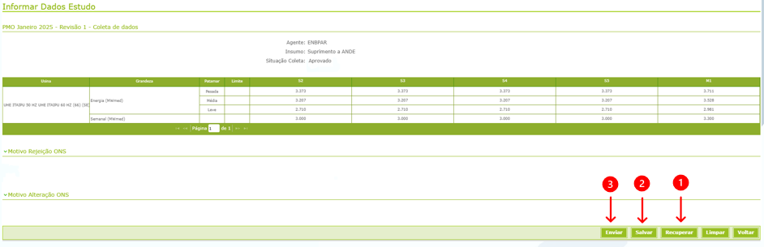

## 5. Contatos e referências

### 5.1. Contatos

Caso haja dúvida em relação aos envios dos insumos, favor enviar para o endereço eletrônico da Equipe do PMO (<pmo@ons.org.br>). Lembrando que é para este mesmo e-mail que deve ser solicitado o cadastro para se acessar o sistema WebPMO, assim como informado no capítulo 3.1.

A equipe também fica disponível para dúvidas na Central de Atendimento do ONS.

### 5.2. Referências

1. RESOLUÇÃO NORMATIVA ANEEL Nº 1.032, DE 26 DE JULHO DE 2022 – <https://www2.aneel.gov.br/cedoc/ren20221032.pdf>
2. Procedimentos de Rede – Submódulo 4.3 (Procedimental) – [Submódulo 4.3-PR](https://apps08.ons.org.br/ONS.Sintegre.Proxy/ecmprsite/ecmfragmentsdocuments/Subm%C3%B3dulo%204.3-PR_2023.11.pdf)
3. Procedimentos de Rede – Submódulo 4.3 (Responsabilidades) – [Submódulo 4.3-RS](https://apps08.ons.org.br/ONS.Sintegre.Proxy/ecmprsite/ecmfragmentsdocuments/Subm%C3%B3dulo%204.3-RS_2020.12.pdf)
4. Área de documentação técnica do CEPEL – <https://www.cepel.br/produtos/documentacao-tecnica/>
5. Ambiente Libs de documentação técnica do CEPEL – <https://see.cepel.br/manual/libs/latest/index.html>
6. Intervalos dos patamares de carga – [SINtegre — Intervalos dos Patamares de Carga](https://sintegre.ons.org.br/sites/9/47/paginas/servicos/historico-de-produtos.aspx?produto=Intervalos%20dos%20Patamares%20de%20Carga)
7. Ferramentas Auxiliares para o PMO – [SINtegre — Ferramentas Auxiliares para o PMO](https://sintegre.ons.org.br/sites/9/52/paginas/servicos/historico-de-produtos.aspx?produto=Ferramentas%20Auxiliares%20para%20o%20PMO)
8. DETERMINAÇÃO DA COORDENAÇÃO DA OPERAÇÃO A CURTO PRAZO - Manual de Referência – [DECOMP — Manual de Metodologia](http://www.cepel.br/wp-content/uploads/2022/03/DECOMP_ManualMetodologia_2020-01_v30.1.pdf)

## Anexo I. Memória de Cálculo

### I.1. Cronograma de Manutenção das Usinas Hidrelétricas

Conforme exemplo trazido na seção 4.1.2, a manutenção na UHE Salto Grande tem duração considerada de **4 dias** dos 7 dias da semana operativa, pois no dia 30/08/24 a manutenção não adentra o "intervalo de ponta", sendo desconsiderada. Além disso, a manutenção é realizada em uma máquina de **18,45 MW** para a usina com potência instalada de **73,8 MW**.

Sendo assim, tem-se:

```math
Pot_{n\tilde{a}o\ dispon\acute{i}vel} = \frac{4 \times 18,45}{7} = 10,5428
```

Logo o fator de manutenção será:

```math
Fator\ de\ Manuten\c{c}\tilde{a}o_{est\acute{a}gio} = \frac{73,8 - 10,5428}{73,8} = 0,857
```

Conforme exemplo trazido na seção 4.1.2, a manutenção na UHE Jayme Canet tem duração considerada de **33 horas** (sendo 16 horas no dia 27/08 e 17 horas no dia 28/08) das 168 horas da semana operativa. Além disso, a manutenção é realizada em uma máquina de **117,36 MW** para a usina com potência instalada de **352,08 MW**.

Sendo assim, tem-se:

```math
Pot_{n\tilde{a}o\ dispon\acute{i}vel} = \frac{33}{168} \times 117,36 = 23,05
```

Logo o fator de manutenção será:

```math
Fator\ de\ Manuten\c{c}\tilde{a}o_{est\acute{a}gio} = \frac{352,08 - 23,05}{352,08} = 0,935
```

### I.2. Disponibilidade, Inflexibilidade e Custo das Usinas Termelétricas

Como mencionado na seção 4.2.2, a planilha "CargaPatamar", disponibilizada anualmente no SINtegre, será apresentada a seguir. A planilha traz uma primeira tabela na sua aba "Hora-Patamar *Ano*", exibindo a informação dos patamares horários para todos os dias do ano, conforme mostra a Figura 57:

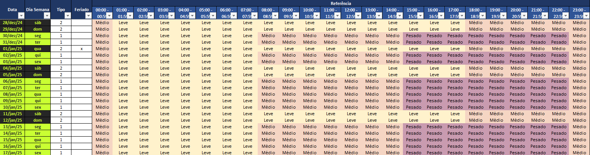

Nas colunas seguintes, há outra tabela na mesma aba, também com a indicação dos patamares de carga, que pode ser usada para preenchimento de valores horários, como a disponibilidade de uma usina termelétrica.

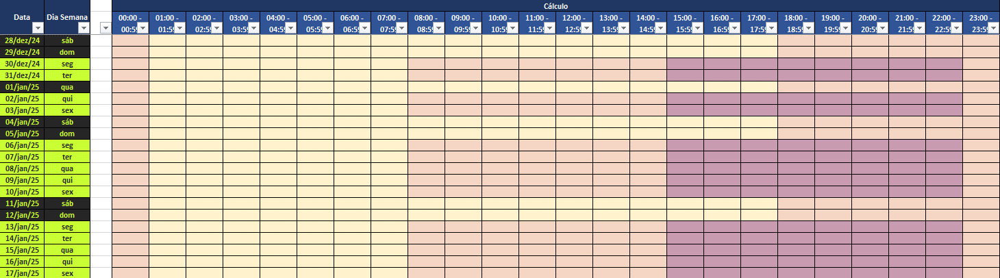

A seguir, o exemplo do cálculo de disponibilidade para a usina termelétrica fictícia trazido na seção 4.2.2 será aplicado à planilha "CargaPatamar", de forma a exemplificar sua utilização, da seguinte forma:

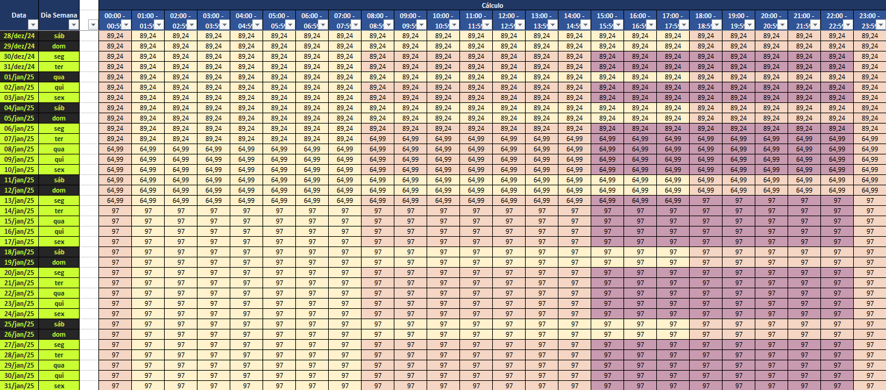

A restrição de 8 MW relativa à UG2, ativa desde 20/12/2024, é considerada desde o início do estudo, até o seu término em 13/01/2025 18:00, restringindo a disponibilidade a 92 MW, que multiplicada pelo fator de capacidade resulta em uma potência efetiva de 89,24 MW. Entre 07/01/2025 08:00 e 13/01/2025 18:00, a UG1 se encontra indisponível, reduzindo adicionalmente 25 MW da disponibilidade, chegando-se ao valor de 67 MW, que multiplicado pelo fator de capacidade nos retorna uma disponibilidade de 64,99 MW. A partir do término das intervenções, a usina retoma sua disponibilidade plena de 100 MW, com potência efetiva de 97 MW.


[^1]: Detentores, por concessão ou autorização, de usinas e reservatórios simulados individualmente nos modelos energéticos.

[^2]: Descrevem detalhadamente a metodologia e modelagem matemática utilizada pelos modelos.

[^3]: Descrevem aspectos processuais de utilização dos modelos.

[^4]: A transmissão das reuniões do PMO fica disponível na página inicial do site do ONS (ons.org.br) ou diretamente no link da transmissão (vocs.tv/ons).

[^5]: O Fórum do PMO fica aberto das 9:00 às 12:00 de sexta-feira para envio de eventuais dúvidas e/ou questionamentos sobre o deck preliminar disponibilizado.

[^6]: De manhã, é publicado o Informe Preliminar do PMO e à tarde são publicados o Informe para a Bandeira Tarifária, o Relatório Executivo do PMO e a Nota Técnica do PMO.

[^7]: O Fórum do PMO fica aberto das 9:00 às 12:00 de sexta-feira para envio de eventuais dúvidas e/ou questionamentos sobre o deck preliminar disponibilizado.

[^8]: A transmissão das Reuniões Semanais da Programação da Operação fica disponível na página inicial do site do ONS (ons.org.br) ou diretamente no link da transmissão (vocs.tv/ons).

[^9]: De manhã, é publicado o Informe Preliminar do PMO e à tarde são publicados o Relatório Executivo do PMO e a Nota Técnica do PMO.

[^10]: No SINtegre, o sistema WebPMO leva o nome de SGIPMO. Dessa forma, o acesso de novos usuários deve ser solicitado para o sistema "SGIPMO".
